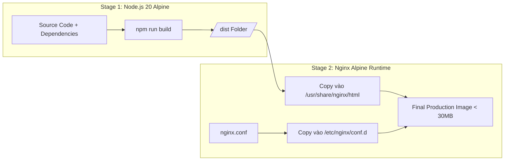

# HƯỚNG DẪN CONTAINER HÓA VỚI DOCKER & NGINX (DOCKER.MD)

Tài liệu hướng dẫn đóng gói và triển khai ứng dụng Frontend **Cover Letter Creator** bằng Docker và Nginx theo chuẩn Enterprise.

---

## 1. Kiến trúc Đóng gói (Multi-stage Build Architecture)

Dự án áp dụng mô hình **Multi-stage Dockerfile** tối ưu dung lượng image và bảo mật:
- **Stage 1 (Builder - Node 20 Alpine)**: Tiếp nhận mã nguồn, cài đặt dependencies sạch (`npm ci`), truyền các biến build-time và biên dịch mã nguồn thành static HTML/JS/CSS tại thư mục `/app/dist`.
- **Stage 2 (Production Runtime - Nginx 1.27 Alpine)**: Chỉ copy thư mục `/app/dist` đã build và file cấu hình `nginx.conf`, loại bỏ hoàn toàn Node.js runtime và `node_modules` giúp image siêu nhẹ (< 30 MB) và an toàn tuyệt đối.



---

## 2. Hướng dẫn Build Image & Chạy Container

### 2.1. Build Docker Image
```bash
# Build với các tham số môi trường tùy chọn
docker build \
  --build-arg VITE_BACKEND_URL=http://localhost:8080 \
  --build-arg VITE_API_KEY_TINY=your_tinymce_key \
  --build-arg VITE_CLIENT_ID=your_google_client_id \
  --build-arg VITE_GITHUB_CLIENT_ID=your_github_client_id \
  -t cover-letter-fe:latest .
```

### 2.2. Khởi chạy Container
```bash
docker run -d \
  --name cover-letter-fe \
  -p 3000:80 \
  --restart always \
  cover-letter-fe:latest
```
- Truy cập ứng dụng tại: `http://localhost:3000`

---

## 3. Triển khai bằng Docker Compose (Khuyến nghị)

Tạo file `docker-compose.yml` trong thư mục dự án để quản lý container tiện lợi:

```yaml
version: '3.8'

services:
  frontend:
    build:
      context: .
      dockerfile: Dockerfile
      args:
        VITE_BACKEND_URL: http://backend:8080
        VITE_API_KEY_TINY: ${VITE_API_KEY_TINY:-no-api-key}
        VITE_CLIENT_ID: ${VITE_CLIENT_ID}
        VITE_GITHUB_CLIENT_ID: ${VITE_GITHUB_CLIENT_ID}
    container_name: coverletter-frontend
    ports:
      - "3000:80"
    restart: unless-stopped
    networks:
      - app-network

networks:
  app-network:
    driver: bridge
```

Khởi chạy bằng lệnh:
```bash
# Khởi động dịch vụ ở chế độ background
docker compose up -d

# Xem log container
docker compose logs -f frontend

# Dừng dịch vụ
docker compose down
```

---

## 4. Các Điểm Quan Trọng trong Cấu hình `nginx.conf`

1. **SPA Fallback Routing**:
   ```nginx
   location / {
       try_files $uri $uri/ /index.html;
   }
   ```
   *Tác dụng*: Ngăn chặn triệt để lỗi 404 Not Found khi người dùng truy cập trực tiếp hoặc tải lại trang tại các đường dẫn con như `/admin`, `/editor`, `/template/all`.

2. **Nén Gzip (Gzip Compression)**:
   - Kích hoạt nén gzip cho toàn bộ các định dạng văn bản: CSS, JS, JSON, XML, SVG giúp giảm đến 70% dung lượng truyền tải mạng.

3. **Bộ nhớ đệm Tài nguyên Tĩnh (Static Asset Caching)**:
   ```nginx
   location ~* \.(?:css|js|woff2?|eot|ttf|otf|png|jpe?g|gif|ico|svg|webp)$ {
       expires 1y;
       add_header Cache-Control "public, max-age=31536000, immutable";
       access_log off;
   }
   ```
   *Tác dụng*: Tận dụng cơ chế hash tên file của Vite (`index-[hash].js`) để cache vĩnh viễn trên trình duyệt người dùng, tối ưu tốc độ tải trang ở các lần truy cập tiếp theo.

4. **Security Headers**:
   - Cung cấp sẵn các header bảo vệ: `X-Frame-Options: SAMEORIGIN`, `X-Content-Type-Options: nosniff`, `X-XSS-Protection: 1; mode=block`.
